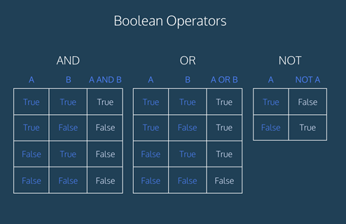

## Python: Logical Operators
### PRIMM: Predict the Output

### Directions

Use the table below to predict the output of each code snippet.



```python
# Example 1
grade = 85
is_extra_credit = True

if grade >= 90 or is_extra_credit:
    print("You got an A on your essay!")
else:
    print("You earned less than an A on your essay.")
```

```python
# Example 2
number = -5

if number > 0 or number < 0:
    print("The number is not zero.")
```
```python
# Example 3
age = 25
has_driver_license = True

if age >= 18 and has_driver_license:
    print("You are eligible to drive.")
```

```python
# Example 4
x = 10
y = 20
z = 30

if (x < y) and (y < z):
    print("The numbers are in ascending order.")
```

```python
# Example 5
age = 15
has_parent_consent = True

if age >= 18:
    print("You are an adult.")
else:
    if has_parent_consent:
        print("With parental consent, you can go on the field trip next week.")
    else:
        print("Sorry, but you cannot go on the field trip next week.")
```

```python
# Example 6
age = 65
is_student = True

if age >= 65 or is_student:
    print("You are eligible for a 20% discount.")
```

